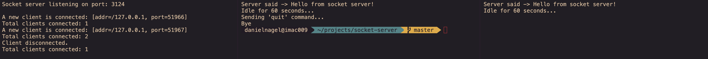

# Socket Server and Client Implementation

I needed a quick test to connect as many clients over one socket with one server and this is the result.

> I was actually to lazy to add cli parameter support neither for the java classes nor the powershell script.

## Getting started

### Install

1. Run `javac Server.java`
1. Run `javac Client.java`

### Start

1. Run `java Server`
1. Run `java Client` as many times as you want.

## Starting clients with the script

It even comes with a powershell script to start a fixed amount of clients, e.g. 50.
